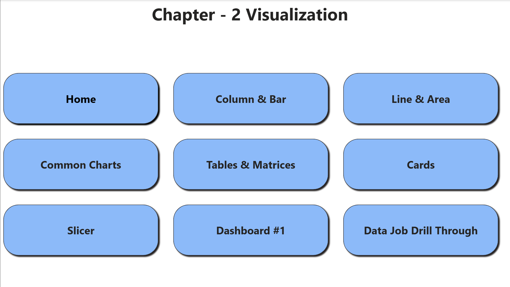
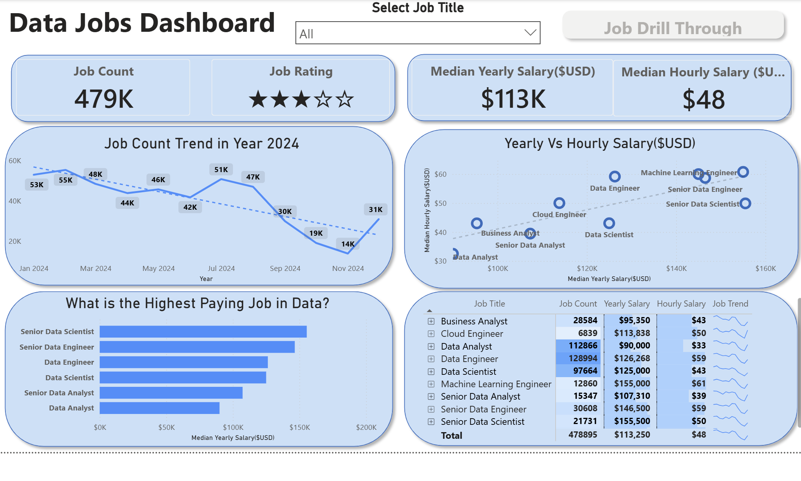
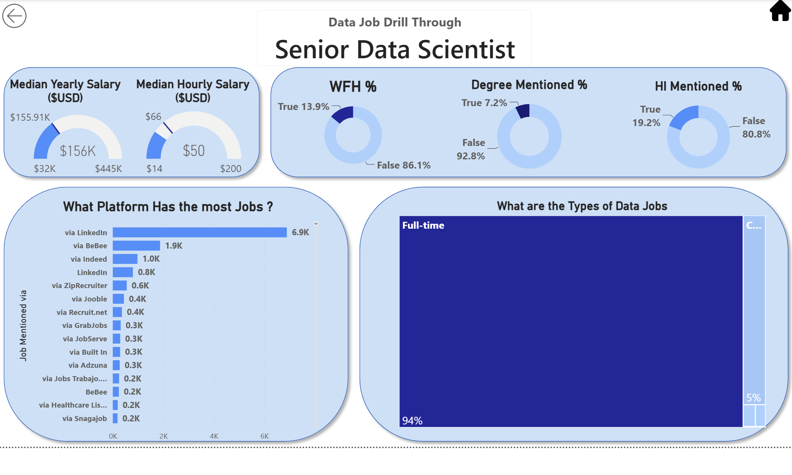
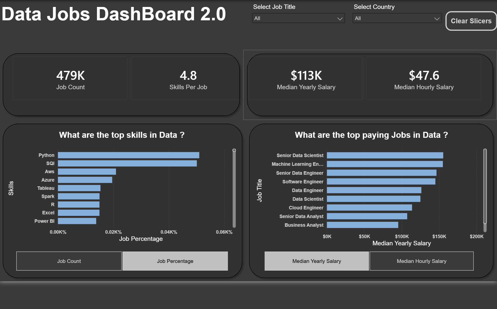
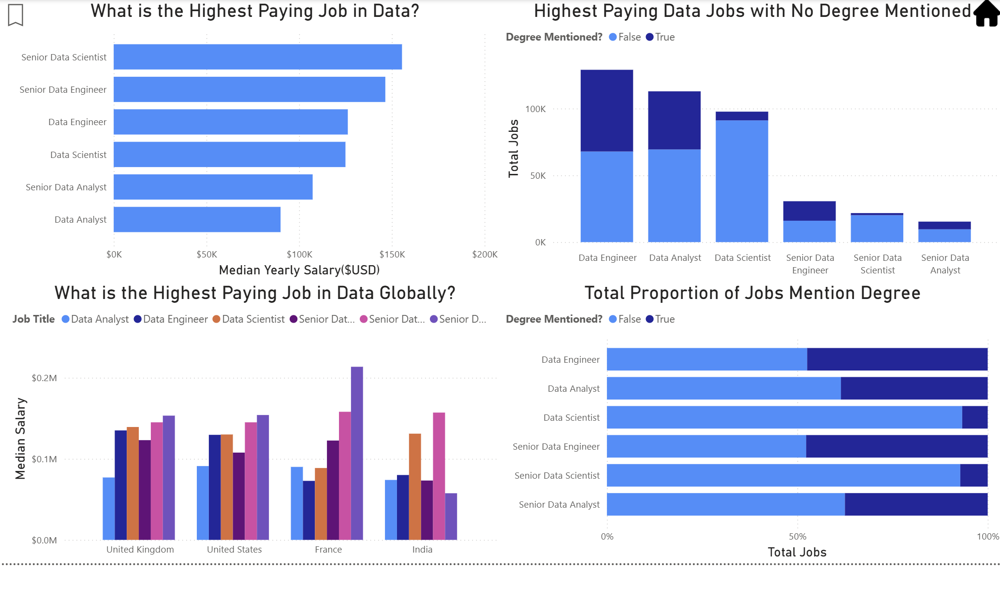
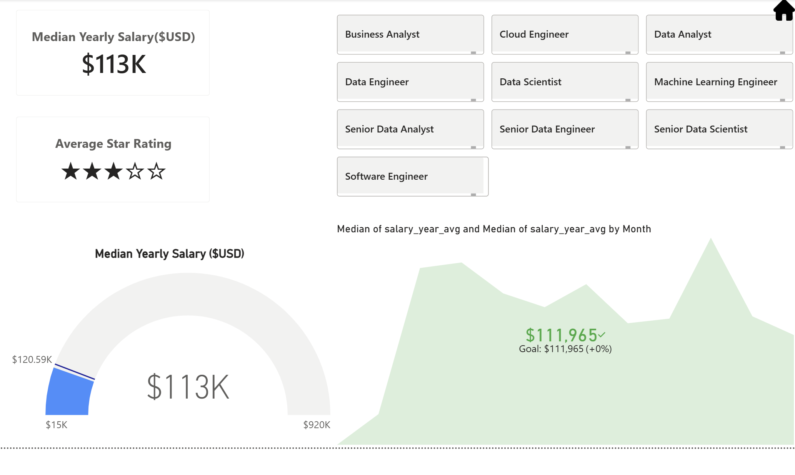
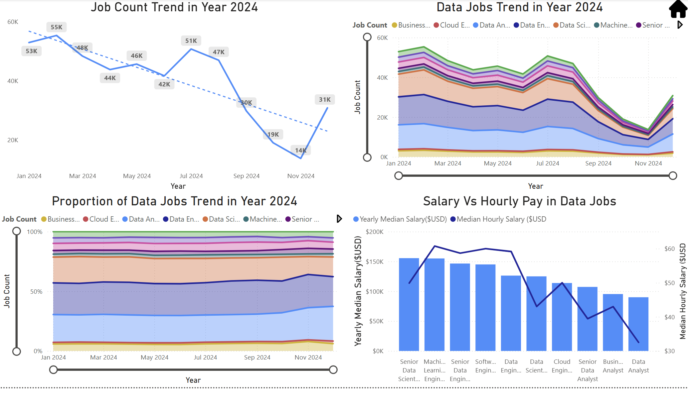
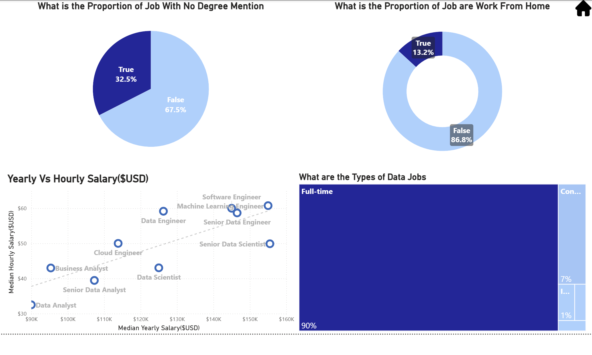

# 📊 Power BI Data Jobs Dashboard

An interactive **Power BI dashboard for analyzing data job postings**, developed as part of my Power BI learning journey following the tutorial by **Luke Barousse**.

The project explores data-job salaries, job demand, skills, work-from-home opportunities, degree requirements, job types, and other employment trends using interactive Power BI visualizations.

---

## 📌 Project Overview

The goal of this project was to learn how to transform raw job-posting data into an interactive and informative business intelligence dashboard.

Using **Power BI and DAX**, I created multiple report pages and visualizations to explore:

- 💰 Data job salaries
- 📈 Job posting trends
- 🧑‍💻 Most in-demand data roles
- 🛠️ Most frequently requested skills
- 🎓 Degree requirements
- 🏠 Work-from-home opportunities
- 🌎 Job distribution across countries
- 💼 Job types and employment trends
- ⭐ Highest-paying data jobs

---

## 🛠️ Tools & Technologies

- **Power BI**
- **DAX**
- **Power Query**
- **Data Modeling**
- **Data Visualization**
- **Interactive Dashboard Design**
- **Data Analysis**

---

## 📊 Dashboard Pages

### 🏠 Home

The home page provides navigation to the different sections of the Power BI report.



---

### 📊 Data Jobs Overview

An overview of the data-job market with key metrics and visualizations.



---

### 🔎 Job Drill-Through

An interactive drill-through page that allows users to explore individual job information in more detail.



---

### 💼 Skills & Top-Paying Jobs

Analysis of the most valuable skills and the highest-paying data roles.



---

## 📈 Visualizations

### Bar Charts

Used to compare salaries, job counts, skills, and other categorical variables.



### KPI Cards

Used to highlight important metrics and provide a quick overview of the dataset.



### Line & Area Charts

Used to analyze trends in data-job postings over time.



### Pie / Donut Charts

Used to visualize proportions such as job types, degree requirements, and other categorical distributions.



---

## 🔍 Key Questions Explored

This dashboard was designed to answer questions such as:

1. Which data jobs have the highest salaries?
2. Which data roles are most in demand?
3. Which skills are most frequently requested by employers?
4. How do salaries vary between different data roles?
5. How does job demand change over time?
6. Which countries have the most data-job opportunities?
7. How many jobs offer work-from-home opportunities?
8. How common are degree requirements?
9. Which skills are associated with higher-paying jobs?
10. What are the major trends in the data-job market?

---

## ⚙️ Power BI Features Practiced

During this project, I practiced and implemented:

- Data import and transformation
- Power Query
- Data cleaning
- Data modeling
- Relationships between tables
- DAX measures
- Calculated columns
- KPI cards
- Bar and column charts
- Line charts
- Area charts
- Pie and donut charts
- Scatter plots
- Treemaps
- Tables and matrices
- Slicers
- Filters
- Conditional formatting
- Drill-through pages
- Interactive navigation
- Dashboard layout and design
- Data storytelling

---

## 📂 Repository Structure

```text
power-bi-data-jobs-dashboard/
│
├── README.md
│
├── images/
│   ├── 01-home.png
│   ├── 02-bar-charts.png
│   ├── 03-cards.png
│   ├── 04-dashboard-1.png
│   ├── 05-drill-through.png
│   ├── 06-dashboard-2.png
│   ├── 07-line-charts.png
│   └── 08-pie-charts.png
│
└── documentation/
    └── project-notes.txt
